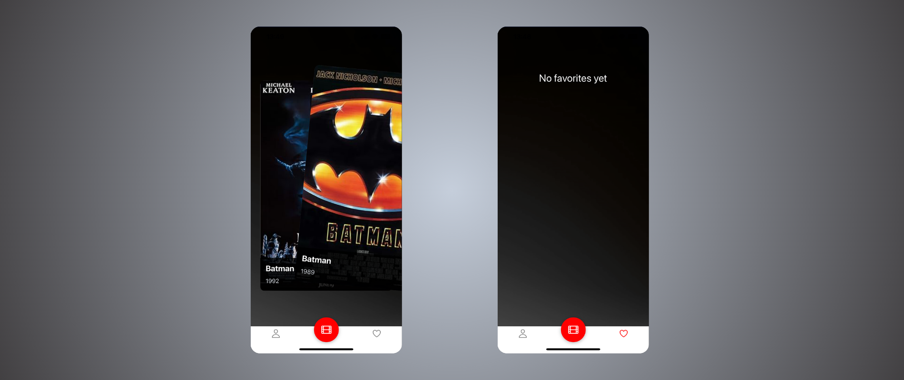

<h1>🚘 Movie Swiper MobileApp </h1>

This 'Movie Swiper' mobile application provides users with a Tinder-like movie rating experience.
    Users can swipe right to like or left to dislike the movie cards that appear, which are fetched from the OMDb API.
    Each movie card displays the title, release year, rating, runtime, genre, and a short plot summary.
    Liked movies are saved to the Favorites section for later viewing.

<h2>Features</h2>

<ul>
    <li>Account creation and login</li>
    <li>Tinder-like swipe interaction (right to like, left to dislike)</li>
    <li>Add movies to favorites for later viewing</li>
    <li>Display detailed movie information (title, year, rating, runtime, genre, plot)</li>
    <li>Smooth and pleasant animations for enhanced user experience</li>
</ul>

<h2>Tech Stack</h2>

React Native, Nativewind, Expo Go, Firebase

<h2>Account</h2>

When the app is launched, the user must log in either with an existing account or register a new one.
    In the case of registration, the user data is saved to the Firebase database.

<h2>Film Details</h2>

After a successful login, the user is presented with swipeable movie cards.
    Movies can be swiped right to like or left to dislike.
    By tapping the small information icon, additional movie details are revealed, including the release year, IMDb
    rating, genre, runtime in minutes, and a short plot summary.

<h2>Swipe</h2>

In the navigation bar, the heart-shaped menu button leads to the Favorites page, where the movies
    liked by the user are listed.
    Naturally, if the user hasn't liked any movies yet, nothing is displayed.

<h2>Favorites</h2>

The liked movies are also displayed as cards in a two-column layout and are stored in the Firebase
    database.
    Users can tap on a card to view the movie’s details.
    Each card has a trash icon in the top-right corner, which allows the user to remove the movie from their favorites
    after confirming a popup message.

<h2>Profile</h2>

In the navigation bar, the user icon opens the personal profile page, where the user can view their
    basic information, such as profile picture, name, email address, and password.
    These details can be edited by pressing a button.
    The profile also displays how many favorite movies the user has, their most liked movie genre, and the average
    rating of their favorite films.
    Naturally, a log out button is also available.

